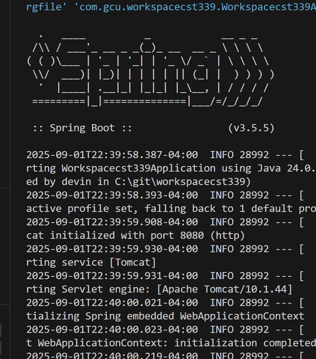
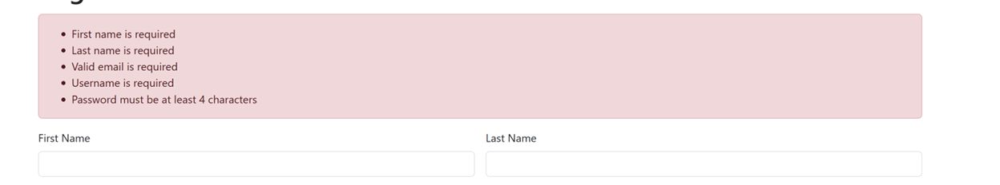
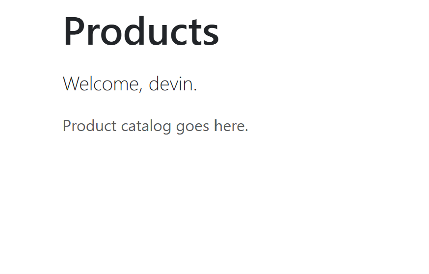
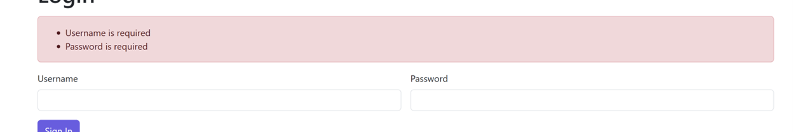

**Name:Devin Puckett**  
**Course:Cst-339**  
**Date:09/02/2025** 
**Professor:Bobby Estey

---

## 1) Build Success Spring Boot banner on 8080

This shows the terminal with Build Success and the Spring Boot banner confirming the app is running on port 8080.

---

## 2) Home  navbar and theme visible

This shows the Home page while logged out, with the Bootstrap navbar and overall theme visible.

---

## 3) Register validation  empty submit shows errors

This shows the registration form displaying validation errors after an empty submit.

---

## 4) Register success Products 

This shows a successful registration redirecting to the Products page, with the navbar updated to show Products and Logout.

---

## 5) Login validation  bad credentials show error

This shows the Login page displaying an error message when bad credentials are submitted.

---

## 6) Responsive  iPhone view of Home with menu toggled

This shows the Home page in Chrome DevTools using an iPhone device view with the mobile menu toggled open.

---

## - Conclusion

This milestone gave me a simple, working Spring Boot app I can explain and demo. I have a home page with a basic theme and navbar, a register and login flow with clear errors, and a products page after I sign in. It runs on 8080 and looks good on mobile with Bootstrap. I kept things readable with small controllers, one lightweight service, and Thymeleaf templates and fragments. No database or security yet.
